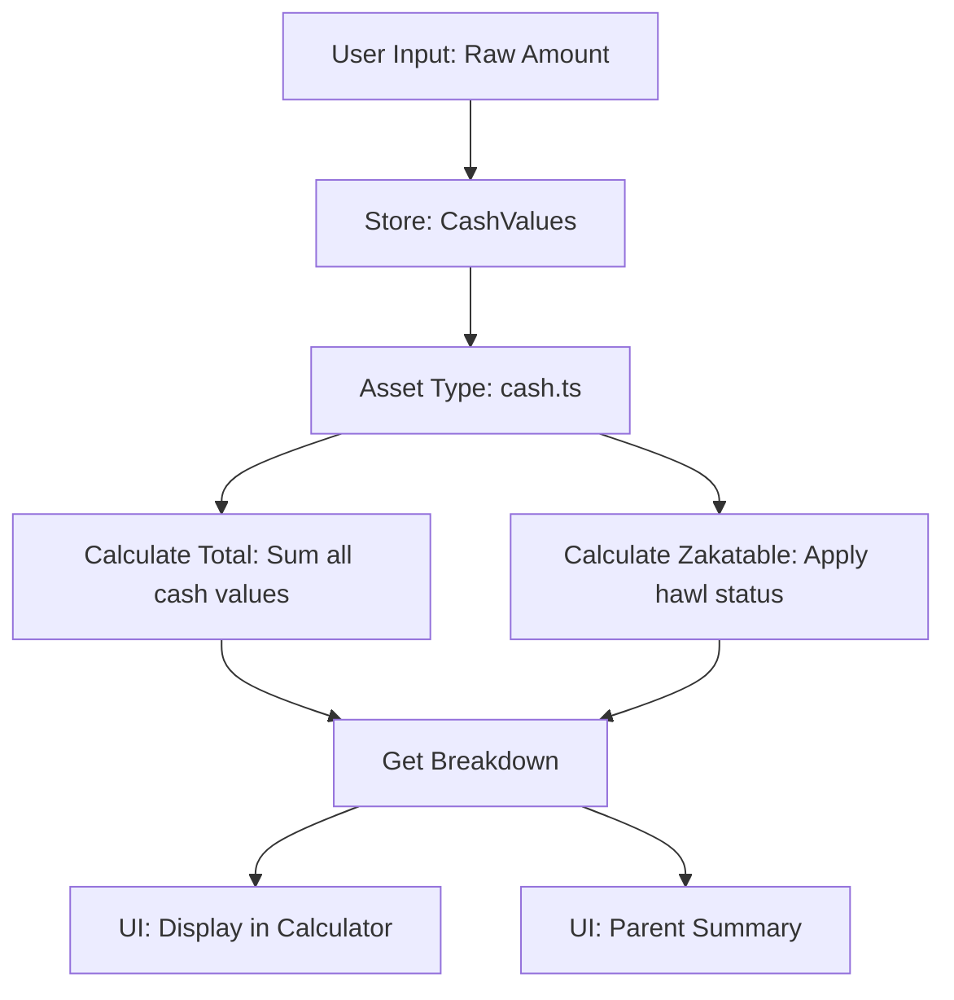
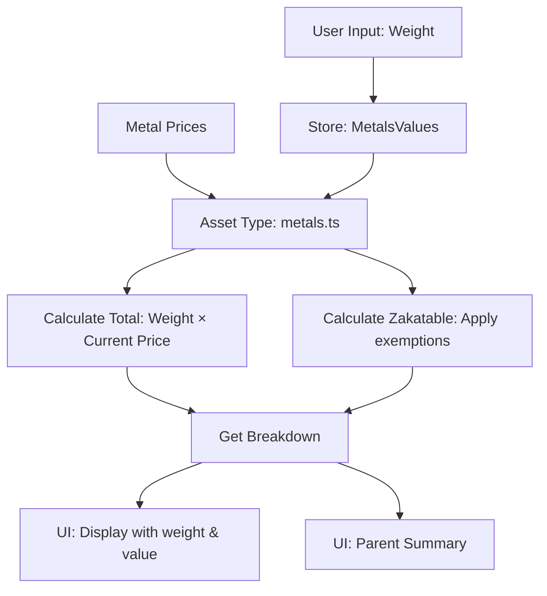
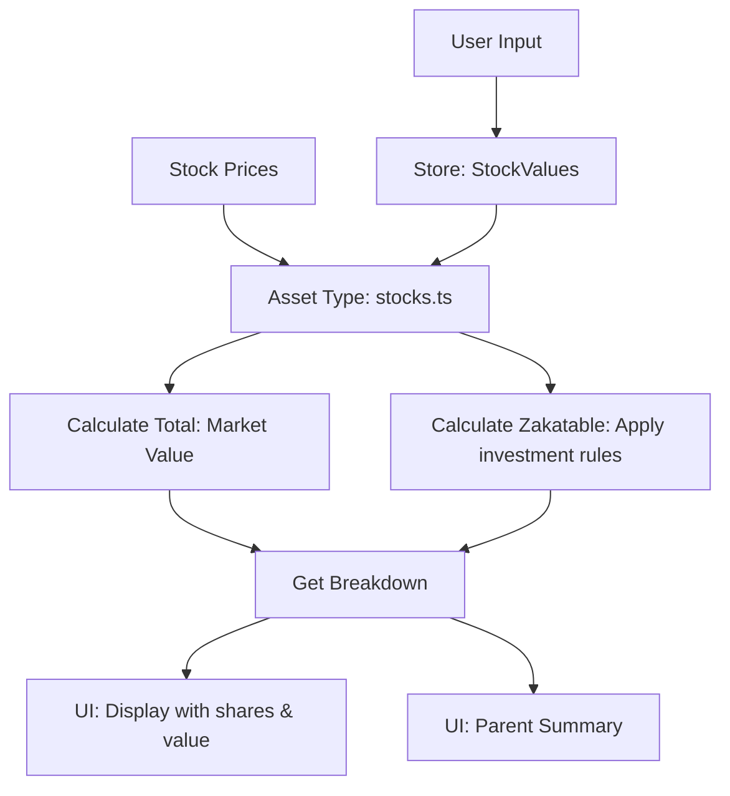
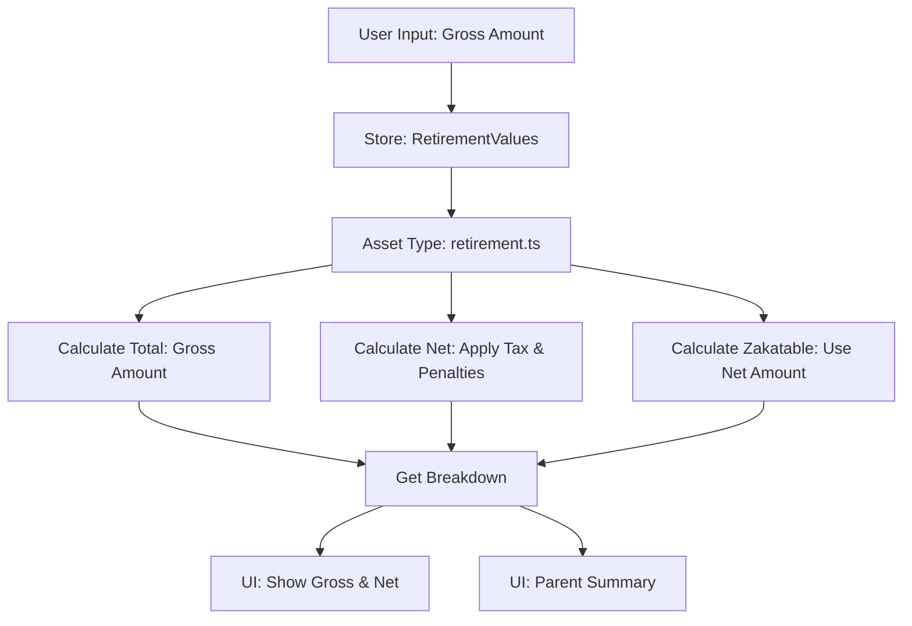
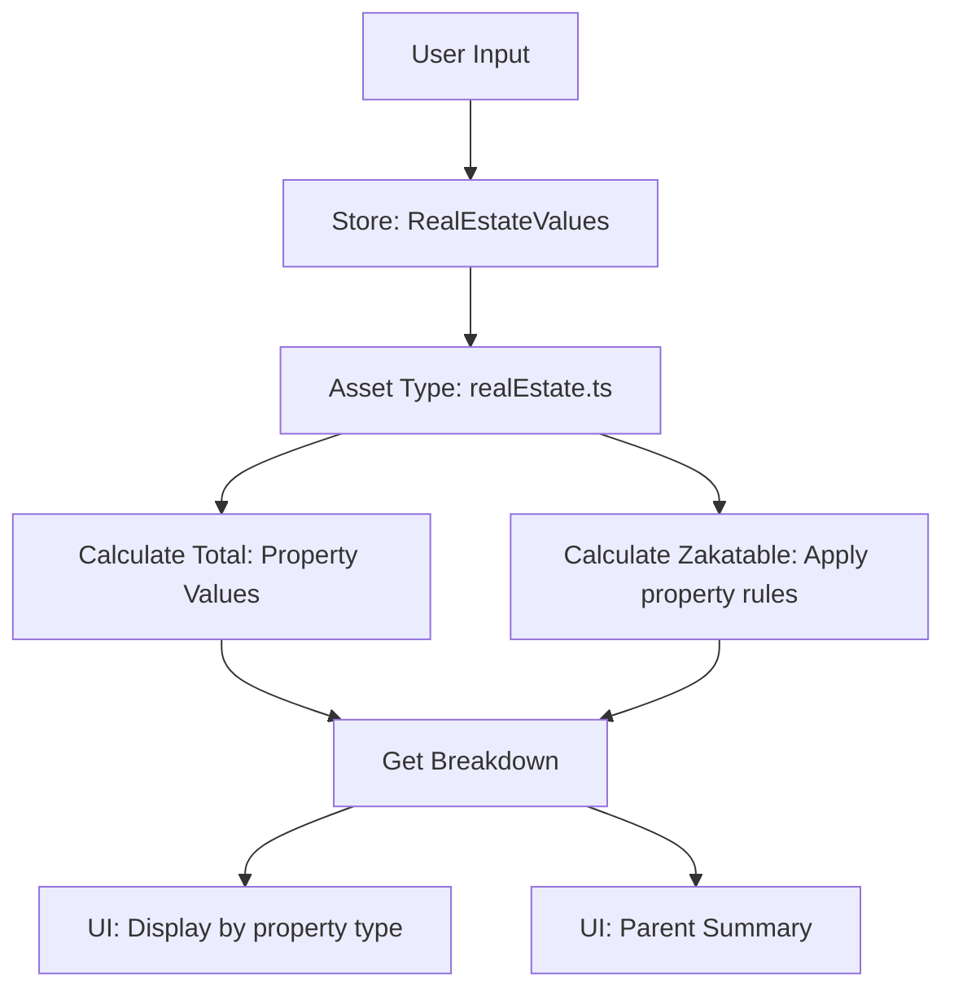
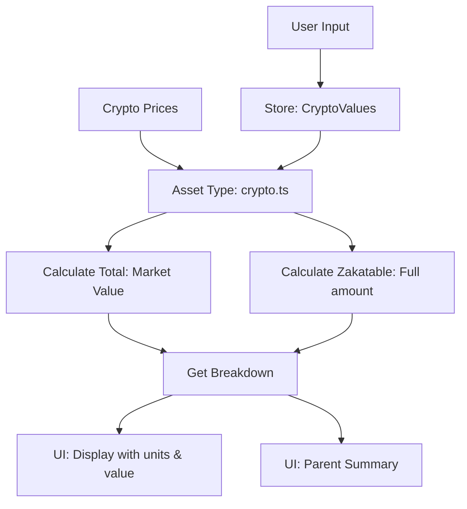

# Zakat Calculator Asset System Architecture

## System Overview

```
┌─────────────────────────────────────────────────────────────────┐
│                         UI LAYER                                 │
│  ┌──────────────┐    ┌──────────────┐    ┌──────────────┐      │
│  │   Cash       │    │   Metals     │    │   Summary    │      │
│  │  Calculator  │    │  Calculator  │    │  Component   │      │
│  └──────┬───────┘    └──────┬───────┘    └──────┬───────┘      │
└─────────┼──────────────────┼───────────────────┼───────────────┘
          │                   │                   │
          ▼                   ▼                   ▼
┌─────────────────────────────────────────────────────────────────┐
│                       STORE LAYER                                │
│  ┌──────────────┐    ┌──────────────┐    ┌──────────────┐      │
│  │   Values     │    │    State     │    │  Computed    │      │
│  │ cashValues   │◄──►│  hawlStatus  │◄──►│   Results    │      │
│  │metalsValues  │    │   prices     │    │              │      │
│  └──────┬───────┘    └──────┬───────┘    └──────┬───────┘      │
└─────────┼──────────────────┼───────────────────┼───────────────┘
          │                   │                   │
          ▼                   ▼                   ▼
┌─────────────────────────────────────────────────────────────────┐
│                    ASSET TYPE SYSTEM                             │
│  ┌──────────────┐    ┌──────────────┐    ┌──────────────┐      │
│  │   Registry   │    │  Asset Type  │    │    Asset     │      │
│  │             │◄──►│  Interface   │◄──►│ Implementations│      │
│  │ getAssetType │    │             │    │ cash/metals   │      │
│  └──────┬───────┘    └──────┬───────┘    └──────┬───────┘      │
└─────────┼──────────────────┼───────────────────┼───────────────┘
          │                   │                   │
          ▼                   ▼                   ▼
┌─────────────────────────────────────────────────────────────────┐
│                   CALCULATION LAYER                              │
│  ┌──────────────┐    ┌──────────────┐    ┌──────────────┐      │
│  │  Business    │    │ Calculation  │    │   Shared     │      │
│  │   Rules      │◄──►│   Logic      │◄──►│  Utilities   │      │
│  │ NISAB/HAWL   │    │             │    │              │      │
│  └──────────────┘    └──────────────┘    └──────────────┘      │
└─────────────────────────────────────────────────────────────────┘
```

## Layer Guidelines

### 1. UI Layer
- Components must be client-side ('use client')
- Use base UI components from src/components/ui/
- Keep form logic separate from calculation logic
- Handle user input validation at this layer

### 2. Store Layer
- Single source of truth (zakatStore)
- All state mutations through setters
- Computed values update automatically
- Persist only necessary state

### 3. Asset Type System
- Each asset type implements AssetType interface
- Register new assets in registry.ts
- Keep asset-specific logic self-contained
- Use shared utilities for common calculations

### 4. Calculation Layer
- Business rules in constants/types
- Asset-specific calculations in implementations
- Shared utilities for common operations
- Maintain type safety throughout

## Adding New Asset Types

1. Create new file in src/lib/assets/
2. Implement AssetType interface
3. Add to registry
4. Create UI components
5. Update store types

Example:
\`\`\`typescript
// src/lib/assets/stocks.ts
export const stocks: AssetType = {
  id: 'stocks',
  name: 'Stocks & Shares',
  color: '#3B82F6',
  
  calculateTotal: (values, prices) => {
    // Implementation
  },
  
  calculateZakatable: (values, prices, hawlMet) => {
    // Implementation
  },
  
  getBreakdown: (values, prices, hawlMet) => {
    // Implementation
  }
}
\`\`\`

## Data Flow

1. User Input → UI Components
2. UI → Store (through setters)
3. Store → Asset Type Calculations
4. Calculations → Computed Results
5. Results → UI Update

## Validation Rules

1. UI Layer
   - Input format validation
   - Basic range checks
   - User feedback

2. Store Layer
   - Type validation
   - State consistency
   - Data persistence

3. Asset Type Layer
   - Business rule validation
   - Calculation validation
   - Type safety

4. Calculation Layer
   - Numerical accuracy
   - Edge cases
   - Business rules compliance

## Error Handling

1. UI Layer
   - User input errors
   - Display validation messages
   - Loading states

2. Store Layer
   - State mutation errors
   - Persistence errors
   - Type errors

3. Asset Type Layer
   - Calculation errors
   - Missing data
   - Invalid states

4. Calculation Layer
   - Division by zero
   - Overflow/underflow
   - Invalid results

## Testing Guidelines

1. UI Layer
   - Component rendering
   - User interactions
   - Form validation

2. Store Layer
   - State mutations
   - Computed values
   - Persistence

3. Asset Type Layer
   - Implementation correctness
   - Edge cases
   - Type safety

4. Calculation Layer
   - Numerical accuracy
   - Business rules
   - Error cases

# Zakat Guide Asset System Data Flow

## Core Principles

1. Store raw/gross values in state
2. Calculate derived values in asset types
3. Transform for display in UI components
4. Use consistent calculation points

## Data Flow by Asset Type

### 1. Cash & Bank


**Value Handling:**
- Store: Raw amounts for each cash type
- Calculations: Simple summation
- Display: Direct values, no transformation needed
- Zakatable: Full amount if hawl met

### 2. Precious Metals


**Value Handling:**
- Store: Weight in grams
- Transform: Weight × Current Price = Value
- Display: Both weight and monetary value
- Zakatable: Based on usage type (regular/occasional/investment)

### 3. Stocks & Investments


**Value Handling:**
- Store: 
  - Active Trading: Shares & current price
  - Passive Investments: Market value & company data
- Transform: 
  - Active: Full market value
  - Passive: Apply 30% rule or company ratio
- Display: Show both shares and monetary value
- Zakatable: Based on investment type and method

### 4. Retirement Accounts


**Value Handling:**
- Store: Gross amounts by account type
- Transform:
  - Accessible Funds: Calculate net after tax & penalties
  - Locked Funds: Track but exempt
- Display: Show both gross and net amounts
- Zakatable: Net amount for accessible funds only

### 5. Real Estate


**Value Handling:**
- Store: Property values and rental income
- Transform: Apply different rules by property type
- Display: Separate personal use from investment
- Zakatable: Only rental income and trading inventory

### 6. Cryptocurrency


**Value Handling:**
- Store: Units and current price
- Transform: Calculate current market value
- Display: Show both units and monetary value
- Zakatable: Full market value if hawl met

## Calculation Points

### 1. Asset Type Level
- Primary calculation point
- Handles all business logic
- Three core functions:
  - calculateTotal()
  - calculateZakatable()
  - getBreakdown()

### 2. Store Level
- Stores raw input values
- Maintains state
- No calculations performed
- Handles persistence

### 3. UI Level
- Displays values
- Formats for presentation
- No calculations performed
- Uses asset type methods

## Value Transformation Rules

1. **Raw Values**
   - Store in original form
   - Use for audit trail
   - Preserve precision

2. **Calculated Values**
   - Compute in asset type
   - Cache when expensive
   - Round appropriately

3. **Display Values**
   - Format for locale
   - Show relevant units
   - Include context

## Validation Points

1. **Input Validation**
   - Type checking
   - Range validation
   - Business rule validation

2. **Calculation Validation**
   - Cross-reference totals
   - Verify breakdowns
   - Check consistency

3. **Display Validation**
   - Format verification
   - Unit consistency
   - Label accuracy

## Error Handling

1. **Input Errors**
   - Validate before store
   - Provide user feedback
   - Prevent invalid state

2. **Calculation Errors**
   - Handle edge cases
   - Provide fallbacks
   - Log issues

3. **Display Errors**
   - Graceful degradation
   - Clear error states
   - User guidance

## Testing Strategy

1. **Unit Tests**
   - Test each transformation
   - Verify calculations
   - Check edge cases

2. **Integration Tests**
   - Verify data flow
   - Test component interaction
   - Validate state updates

3. **End-to-End Tests**
   - Test complete flows
   - Verify UI updates
   - Check persistence 